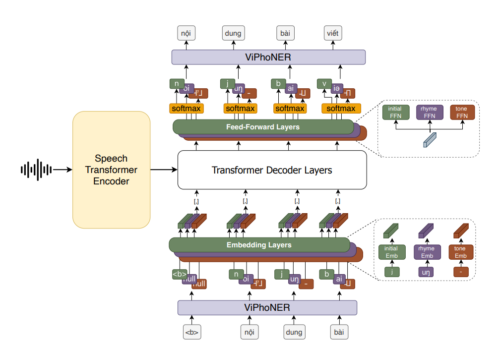

# ViSpeechFormer — Official Implementation

Official implementation of **ViSpeechFormer: A Phonemic Approach for Vietnamese Automatic Speech Recognition**.

Paper: https://arxiv.org/pdf/2602.10003  
Architecture diagram: 

---

# 1. Overview

ViSpeechFormer is a phoneme-based Vietnamese ASR framework that explicitly models Vietnamese syllable structure using a **three-head phonemic decoder**:

- Initial
- Rhyme
- Tone

The model improves OOV generalization by decomposing words into phonological components instead of predicting characters or subwords directly.

Supported datasets:
- LSVSC
- VIVOS

---

# 2. Repository Structure

```
.
├── README.md
├── requirements.txt
├── prep_data.sh
├── train.py
├── eval.py
├── configs/
│   ├── baseline/
│   ├── phoneme-dec/
│   ├── lsvsc-configuration/
│   └── results_path/
│       └── architecture.png
├── core/
│   ├── engine.py
│   ├── inference.py
│   ├── model.py
│   ├── encoders/
│   ├── decoder/
│   └── modules/
└── dataset/
    ├── LSVSC/
    ├── VIVOS/
    ├── dataset.py
    ├── construct.py
    ├── phoneme_construct.py
    └── Vietnamese_utils.py
```

---

# 3. Installation

## 3.1 Create environment

```bash
python -m venv .venv
source .venv/bin/activate
pip install -U pip
```

## 3.2 Install dependencies

```bash
pip install -r requirements.txt
```

If using GPU, ensure your PyTorch version matches your CUDA runtime.

---

# 4. Data Preparation

Run : 

```bash
bash prep_data.sh --word (or char, phoneme) --lsvsc (or vivos)
```

---

# 5. Training

## 5.1 Phoneme Decoder

```bash
python train.py --config configs/phoneme-dec/conformer-config.yaml
```

## 5.2 Baseline (Character/Subword)

```bash
python train.py --config configs/baseline/conformer-transducer-config.yaml
```

---

# 6. Evaluation

```bash
python eval.py --config configs/phoneme-dec/conformer-config.yaml --ckpt /path/to/checkpoint.pt
```

Metrics typically include CER, WER, and phoneme component errors.

---

# 8. Citation

```bibtex
@article{nguyen2026vispeechformer,
  title   = {ViSpeechFormer: A Phonemic Approach for Vietnamese Automatic Speech Recognition},
  author  = {Nguyen, Khoa Anh and Hoang, Long Minh and Nguyen, Nghia Hieu and Nguyen, Luan Thanh and Nguyen, Ngan Luu-Thuy},
  journal = {arXiv preprint arXiv:2602.10003},
  year    = {2026}
}
```


