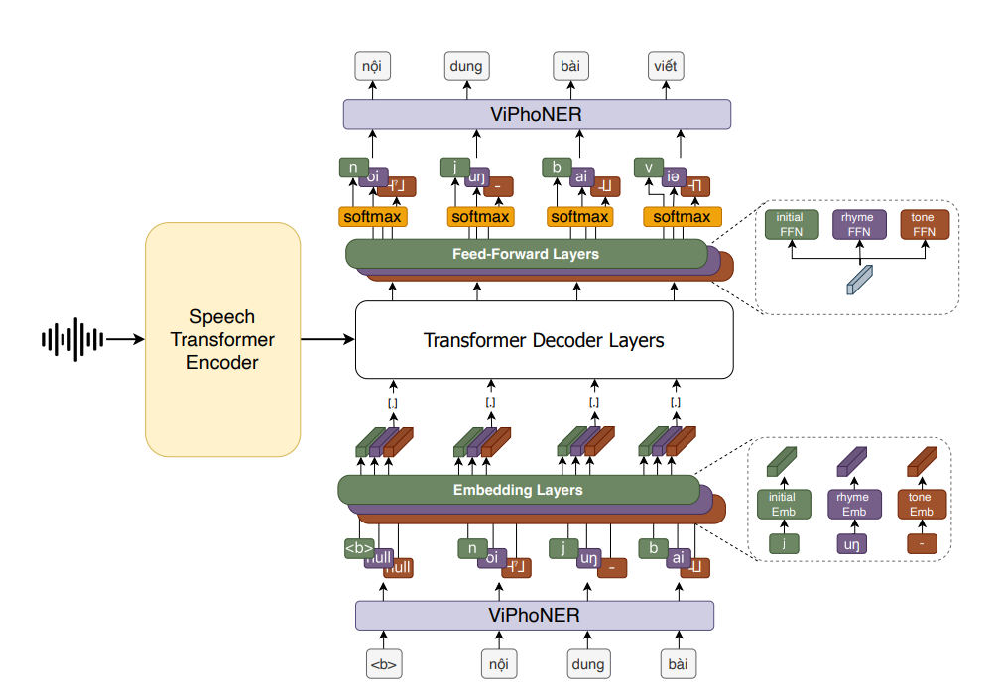

# PhonoASR

PhonoASR is a research framework for training, testing, and comparing automatic speech recognition (ASR) models under a shared Vietnamese speech-processing pipeline. It also contains the official implementation scaffold for **ViSpeechFormer: A Phonemic Approach for Vietnamese Automatic Speech Recognition**.

[Read the paper on arXiv](https://arxiv.org/abs/2602.10003)



## Patent notice: tokenizer temporarily withheld

The ViPhonER Vietnamese phonemic tokenizer and detokenizer implementation is intentionally not included in this public repository while the inventors pursue patent protection. `dataset/Vietnamese_utils.py` is a non-functional compatibility stub that preserves imports and raises a clear `PatentPendingTokenizerError` when tokenizer functionality is requested.

Baseline word-, character-, and subword-level experiments remain available. Phoneme preprocessing and phoneme-to-text reconstruction require authorized access to the private tokenizer; contact the project maintainers for research access.

## Supported ASR models

The framework includes configurations and model components for the following architectures:

| # | Base model |
|---:|---|
| 1 | Conformer |
| 2 | ZipFormer |
| 3 | Recurrent Neural Network Transducer (RNN-T) |
| 4 | Transformer Transducer |
| 5 | ConvRNN-T |
| 6 | Multi-ConvFormer |
| 7 | Speech Transformer |
| 8 | Transformers with convolutional context (Conv-Transformer) |
| 9 | Transmitted and Aggregated Self-Attention (TASA) |

Implementations live under `core/encoders/` and experiment configurations under `configs/baseline/`, `configs/phoneme-dec/`, and `configs/lsvsc-configuration/`.

## Paper-reported results

The values below are reproduced from the paper and have not been recomputed by this README update. CER, WER, and PER are percentages; lower is better unless noted otherwise.

### Main benchmark

| Model | Output level | Decoder parameters | ViVOS CER | ViVOS WER | LSVSC CER | LSVSC WER |
|---|---|---:|---:|---:|---:|---:|
| Conv-Transformer | Subword | 2,559,089 | 16.23 | 32.69 | 7.43 | 12.59 |
| Conformer | Subword | 4,302,032 | 22.87 | 37.61 | 10.61 | 15.71 |
| ZipFormer | Subword | 4,302,032 | 26.34 | 38.87 | 8.88 | 13.33 |
| Multi-ConvFormer | Subword | 4,302,032 | 30.98 | 44.80 | 10.58 | 15.77 |
| TASA | Subword | 2,605,041 | 21.10 | 34.70 | 6.73 | 10.62 |
| Speech Transformer | Character | 1,249,920 | 18.54 | 34.83 | 6.04 | 11.16 |
| **ViSpeechFormer (ours)** | **Phoneme** | **2,007,892** | **11.96** | **30.49** | **5.30** | **10.39** |

### ViSpeechFormer phoneme error rate

| Dataset | Initial PER | Rhyme PER | Tone PER | Overall PER |
|---|---:|---:|---:|---:|
| ViVOS | 12.18 | 20.52 | 13.39 | 15.42 |
| LSVSC | 6.21 | 7.01 | 5.77 | 6.39 |

<details>
<summary>LSVSC generalization and inference analysis</summary>

| Model | Unique correct words | Pearson r (%) | Spearman rho (%) | Correct OOV words (%) | Avg. inference time (s) |
|---|---:|---:|---:|---:|---:|
| Conv-Transformer | 2,393 | 23.99 | 42.69 | 12.53 | 0.0897 |
| Conformer | 1,736 | 41.00 | 87.29 | 3.03 | 0.1786 |
| ZipFormer | 2,367 | 26.00 | 52.17 | 3.03 | 0.1888 |
| Multi-ConvFormer | 1,717 | 39.12 | 87.79 | 2.27 | 0.1845 |
| TASA | 2,440 | 23.12 | 38.99 | 14.39 | 0.0795 |
| Speech Transformer | **2,541** | 22.36 | 30.65 | 13.64 | 0.2778 |
| **ViSpeechFormer (ours)** | 2,498 | **21.54** | **29.54** | **27.27** | 0.1112 |

Lower correlation indicates less dependence on training-word frequency; higher OOV accuracy is better.

</details>

## Datasets

- **ViVOS:** 15 hours of audio and 12,420 transcripts in the paper setup.
- **LSVSC:** 100 hours of audio and 56,824 transcripts in the paper setup.

Dataset-specific notes are available in `dataset/VIVOS/README.md` and `dataset/LSVSC/README.md`.

## Installation

```bash
python -m venv .venv
source .venv/bin/activate
python -m pip install --upgrade pip
python -m pip install -r requirements.txt
```

For GPU training, install a PyTorch build compatible with the host CUDA runtime.

## Data preparation

Word- and character-level preparation remains available in the public repository:

```bash
bash prep_data.sh normal lsvsc
bash prep_data.sh char vivos
```

The `phoneme` path calls the patent-pending ViPhonER tokenizer and therefore fails explicitly in the public version.

## Training

Train any supported model by selecting its YAML configuration:

```bash
python train.py --config configs/baseline/conformer-transducer-config.yaml
```

Phoneme-decoder configurations under `configs/phoneme-dec/` require the private tokenizer and preprocessed phoneme data.

## Evaluation

```bash
python eval.py \
  --config configs/baseline/conformer-transducer-config.yaml \
  --ckpt /path/to/checkpoint.pt
```

The framework reports metrics including CER and WER; phoneme-enabled runs additionally report component-level and overall PER.

## Repository structure

```text
.
├── analysis/                 # Result and model analyses
├── configs/                  # Baseline, phoneme, and dataset configurations
├── core/                     # Encoders, decoders, modules, training, inference
├── dataset/                  # Dataset preparation and public tokenizer stub
├── eval.py
├── prep_data.sh
├── train.py
└── requirements.txt
```

## Citation

```bibtex
@article{nguyen2026vispeechformer,
  title   = {ViSpeechFormer: A Phonemic Approach for Vietnamese Automatic Speech Recognition},
  author  = {Nguyen, Khoa Anh and Hoang, Long Minh and Nguyen, Nghia Hieu and Nguyen, Luan Thanh and Nguyen, Ngan Luu-Thuy},
  journal = {arXiv preprint arXiv:2602.10003},
  year    = {2026}
}
```

## License

See [LICENSE](./LICENSE).
